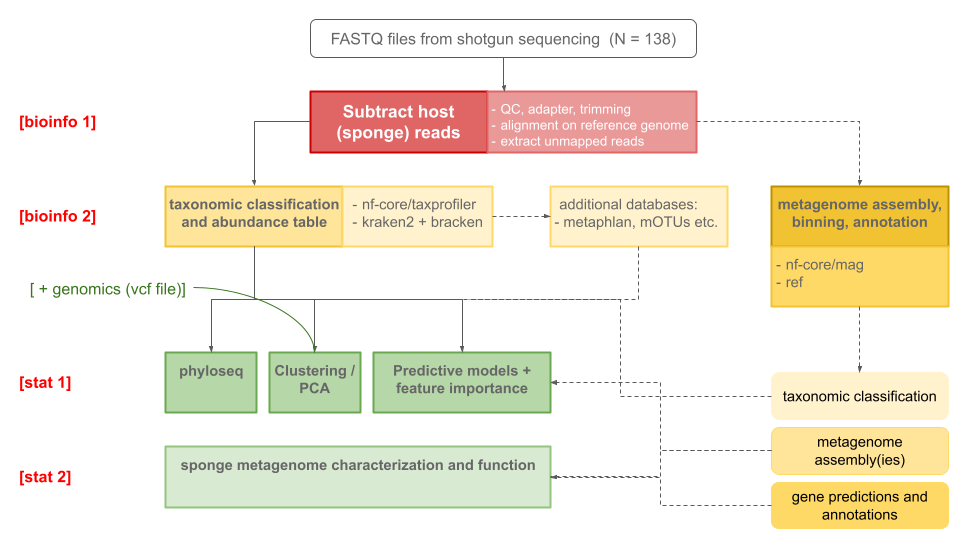

This repository hosts the code and workflow for the bioinformatics processing of sponge metageonmics data.
This is a collaboration between [CNR](https://www.cnr.it/en) (Italy) and [HCMR](https://www.hcmr.gr/en/) (Greece), within the "Metagenomics of Spongia officinalis from the Eastern
Mediterranean sea" [STM](https://www.cnr.it/en/short-term-mobility) (Short-term Mobility) 2026 project.

## General workflow

[bioinfo1] **Subtract host (sponge) reads**
  1. QC, adapter, trimming
  2. alignment on reference genome (which)
  3. extract unmapped reads (more details from Xenia)

[bioinfo2] **Taxonomic classification and abundance table**
  1. nf-core/taxprofiler
  2. kraken2 + bracken

